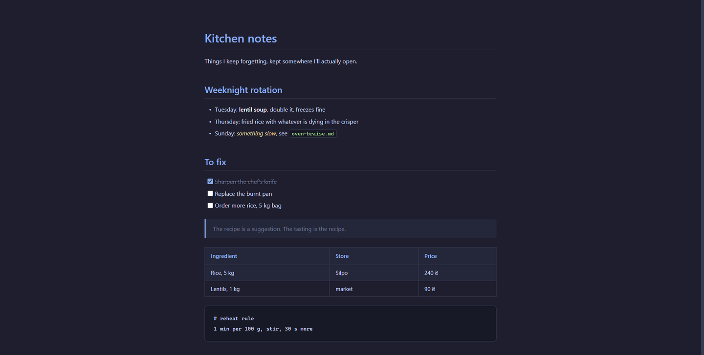

# MarkdownView — a fullscreen WYSIWYG Markdown editor for Windows

Double-click a `.md` file and it opens as a rendered page you can type into. No toolbar, no split pane, no raw `#` symbols. Dark theme, fullscreen, Ctrl+S to save. That's the whole app.

[](https://github.com/ArturLys/markdown-editor-windows/releases/latest)
[](LICENSE)




## Credit where it's due

This is [MarkdownView by DBMaster](https://apps.microsoft.com/detail/9n6pkz6fp1ml) from the Microsoft Store, with one change: **the text is editable.**

Their app is a beautiful fullscreen Markdown *viewer*. I loved the look and hated that I had to open a second program to change a word. So I decompiled it to keep the exact theme, then rebuilt the inside as an editor. The dark palette, the type, the spacing, the layout: all theirs. Go install the original if you only need to read.

## What it does

- **Opens straight into editing.** No view mode, no edit mode, no toggle. The document *is* the editor.
- **Markdown formatting as you type.** `# ` becomes a heading, `- ` a bullet, `> ` a quote, ` ``` ` a code block, `[ ] ` a checkbox, `**bold**` bold. The syntax disappears and the formatting stays, the way Notion and Typora do it.
- **One shortcut.** Ctrl+S saves. Esc or the ✕ closes, saving first if anything changed.
- **Nothing else on screen.** Fullscreen, borderless, no status bar, no menu, no settings, no sidebar.
- **Plain `.md` on disk.** Ordinary Markdown in, ordinary Markdown out, so the file still works in Obsidian, GitHub, VS Code, anywhere.
- **Opens on the monitor you're using**, sized to that whole screen.

Good for quick notes, READMEs, journals, todo lists, and reading docs you occasionally need to fix a typo in. It is not trying to be Obsidian.

## Download

Get it from **[Releases](https://github.com/ArturLys/markdown-editor-windows/releases/latest)**, unzip anywhere, and run `MarkdownView.exe`. There is no installer.

| File | Size | Needs |
|---|---|---|
| `MarkdownView-win-x64-selfcontained.zip` | ~72 MB | nothing, just run it |
| `MarkdownView-win-x64.zip` | ~7 MB | [.NET 10 Desktop Runtime](https://dotnet.microsoft.com/download/dotnet/10.0) |

Both need the WebView2 runtime, which Windows 11 already ships with.

### Make it your default Markdown editor

Right-click any `.md` file → **Open with** → **Choose another app** → browse to `MarkdownView.exe` → tick **Always**.

Windows validates that association with a per-user hash, so it can't be set by a script without reproducing the hash. `tools/userchoice_hash.py` is an unfinished port of it, kept as a starting point.

## Questions people actually ask

**Is there a free WYSIWYG Markdown editor for Windows?** This one, and Typora is the paid one everybody names.

**Does it save real Markdown or some proprietary format?** Real Markdown. Round-tripping through a rich editor can normalise small things, like `*` bullets becoming `-`, but the content and the file stay plain `.md`.

**Can I use it with Obsidian or a git repo?** Yes. It edits a file in place and touches nothing else. No vault, no database, no config directory.

**Why not just use VS Code?** VS Code shows you raw Markdown with a preview pane next to it. This shows you the rendered page and lets you type into it.

**Does it work offline?** Entirely. The editor is bundled into the app; nothing is fetched at runtime.

## How it's built

| Layer | What |
|---|---|
| Shell | WPF on .NET 10, one borderless window sized to the monitor |
| Surface | WebView2 rendering a local page over a virtual host mapping |
| Editor | [TipTap](https://tiptap.dev) (ProseMirror) with [tiptap-markdown](https://github.com/aguingand/tiptap-markdown), bundled offline by esbuild |

The C# side owns the file. It reads it on launch, gets the Markdown back over the WebView message channel, and writes it to disk. The web page never touches the filesystem.

Two details worth knowing if you fork it:

- **Bullets are drawn with a `::before` dot** instead of a native list marker. Native `::marker` geometry can't be styled or measured, so task checkboxes could never be lined up with it. Drawing both by hand puts them on one axis.
- **The virtual host must not end in `.local`.** That suffix is reserved for multicast DNS, so Windows spends about two seconds asking the network about it before the request ever reaches your own local folder. Renaming the host cut startup from 3.4s to 1.4s.

### Build from source

Needs the .NET 10 SDK and Node.

```bash
cd src/web-src && npm install && npm run build
cd .. && dotnet publish -c Release -o ../dist
```

The first command bundles the editor into `src/web/editor.js`, the second produces `dist/MarkdownView.exe`. Set `MDV_TIMING=1` to get a startup breakdown in `%TEMP%\markdownview-timing.log`.

## License

MIT. The theme is DBMaster's, see [LICENSE](LICENSE). Their compiled app is not in this repository.
